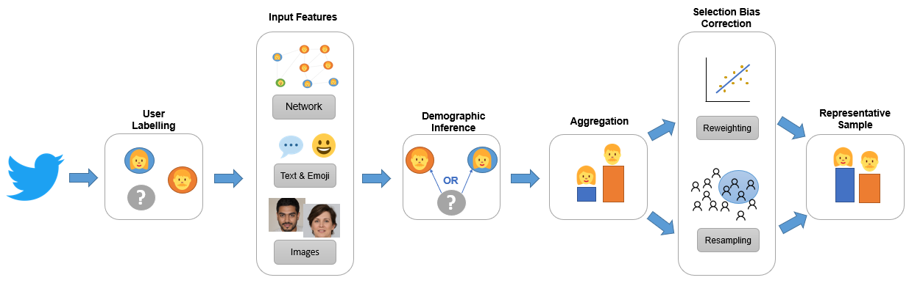

# Twitter-Selection-Bias

This repository contains the code implementation of the thesis "Understanding and Correcting Selection Bias in the Sentiments derived from Flemish Tweets" written by Jonathan Tonglet and Astrid Jehoul under the supervision of Manon Reusens and Bart Baesens. The project was conducted in partnership with Statistiek Vlaanderen, represented by Michael Reusens.

  

Social media sources, and Twitter especially, constitute an interesting alternative to traditional surveys to monitor public opinion, as they are produced much faster, in larger volumes and without direct implication of the analyst. However, the demographic distribution of the Twitter population does not always match census data. This problem, known as selection bias, is well-known in survey methodology and its correction is performed by resampling and reweighting methods which usually requires demographic information about the collected sample. However demographic attributes on Twitter are not directly available and need to be inferred. 
The objective of this thesis is to define a process to infer the demographic attributes of Twitter users located in Flanders and to correct selection biases with resampling and reweighting methods. 

## Snorkel and Programmatic Weak Supervision

  
Demographic inference is characterized by a label scarcity problem, as the raw data collected from the Twitter API does not come with demographic labels. A first solution is to manually label a sample of users. However this approach is costly and not scalable. This paper relies on Programmatic Weak Supervision, a unified framework of weak supervision approaches, to generate a weakly labeled training set.  
  
  

## Structure of the repository

  
- *Classifiers* :  Scripts to create a feature matrix and  train the noisy classifiers on the weakly labeled training set.
- *Data_Collection* : Scripts used to collect data from the Twitter Academic Research API and to format in a Pandas DataFrame. Data collection code is largely inspired from [this](https://towardsdatascience.com/an-extensive-guide-to-collecting-tweets-from-twitter-api-v2-for-academic-research-using-python-3-518fcb71df2a) excellent online tutorial. Includes code to identify active user accounts, perform a train-test split and remove company accounts from the training set.
- *Data_Labeling* : Code to create Labeling Functions and a weakly labeled training set using the Snorkel generative label model. It also includes keywords lists and knowledge sources used by the labeling functions.
- *Demographic_Inference* : Code to perform demographic inference with the extended generative model  or the [M3](https://github.com/euagendas/m3inference) model.
- *Selection_Bias_Correction* : Scripts to correct selection bias using a resampling method and to compute the Twitter inclusion probabilities.
  
  

  
## Data Access

Due to privacy reasons, the twitter data collected for the thesis experiments cannot be shared online. However, aggregated demographic predictions are available in ....
  
## Requirements

  
This repository requires Python 3.8. The list of required packages can be found in *requirements.txt*
  
  

